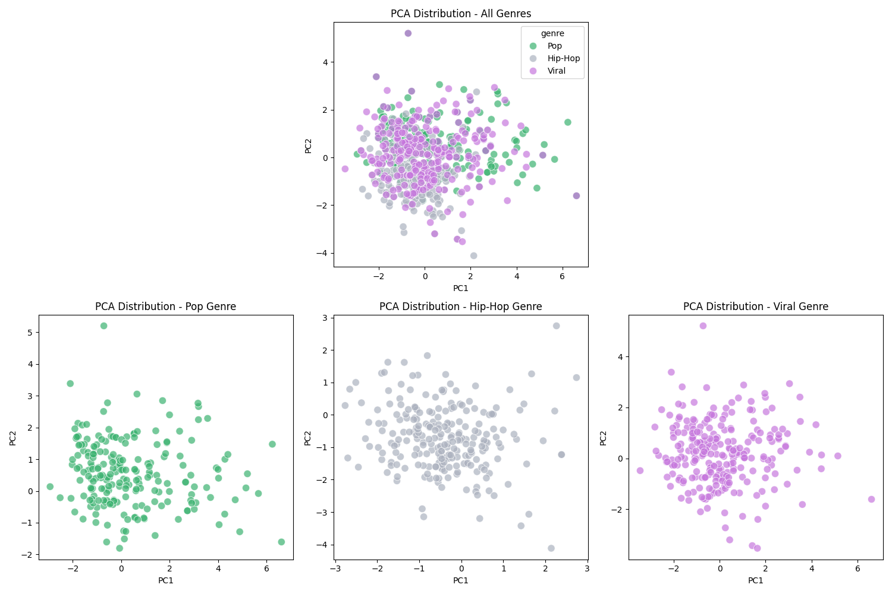

<!-- Styling -->

<style>
.section_title {
  color: MediumSeaGreen;
  letter-spacing: 2px;
  font-size: 120%;
}
.subsection_title {
  letter-spacing: 2px;
  font-size: 120%;
  font-weight: bold; 
}
.subtitle {
  color: MediumSeaGreen;
  font-weight: medium;
  letter-spacing: 2px;
  font-size: 120%;
}
.genre-playlist-list {
	text-align: center;
	letter-spacing: 2px;
	text-decoration: underline MediumSeaGreen 2px;
	text-underline-offset: 50%;
	margin-top: 5%;
}
.label {
  color: #acb2bf;
  font-weight: 500;
  letter-spacing: 1px;
  font-size: 100%;
  padding-bottom: 0%;
}
.toggle {
  color: #c678dd;
  letter-spacing: 1px;
  font-weight: medium;
  font-size: 95%;
  margin-bottom: 10px;
}
.dataframe tbody tr th:only-of-type {
  vertical-align: middle;
  text-align: left;
}
.dataframe tbody tr th {
  vertical-align: top;
  text-align: left;
}
.dataframe thead th {
  text-align: center;
  background-color: rgba(60, 179, 113, 0.2); /* MediumSeaGreen with alpha of 0.2 */
}
</style>

<!-- README Content -->

<body>

<div style="background-color: #282c35; padding: 20px">

<a id="readme-top"></a>

<!-- Project Title -->

<h1 style="color: MediumSeaGreen; font-size: 400%; text-align: center; letter-spacing: 7px;">Sounds of Virality</h1>

<!-- TABLE OF CONTENTS -->

<details>
  <summary style="color: #c678dd; letter-spacing: 2px; font-weight: 500;">Table of Contents</summary>
  <div style="color: #c678dd;">
  <ol>
    <li>
      <a href="#about-the-project"><span style="color: #c678dd;">About The Project</span></a>
      <ul>
        <li><a href="#introduction"><span style="color: #c678dd;">Introduction</span></a></li>
        <li><a href="#overview"><span style="color: #c678dd;">Overview</span></a></li>
      </ul>
    </li>
    <li>
      <a href="#getting-started"><span style="color: #c678dd;">Getting Started</span></a>
      <ul>
        <li><a href="#technologies-and-libraries-used"><span style="color: #c678dd;">Technologies and Libraries Used</span></a></li>
        <li><a href="#installation-and-setup"><span style="color: #c678dd;">Installation and Setup</span></a></li>
				<li><a href="#usage"><span style="color: #c678dd;">Usage</span></a></li>
      </ul>
    </li>
		<li>
      <a href="#methods"><span style="color: #c678dd;">Methods</span></a>
      <ul>
        <li><a href="#data-collection"><span style="color: #c678dd;">Data Collection</span></a></li>
        <li><a href="#data-analysis"><span style="color: #c678dd;">Data Analysis</span></a></li>
      </ul>
    </li>
		<li>
      <a href="#results"><span style="color: #c678dd;">Results</span></a>
      <ul>
        <li><a href="#cda-results"><span style="color: #c678dd;">CDA Results</span></a></li>
        <li><a href="#pca-results"><span style="color: #c678dd;">PCA Results</span></a></li>
        <li><a href="#tsne-results"><span style="color: #c678dd;">t-SNE Results</span></a></li>
      </ul>
    </li>
		<li>
      <a href="#discussion"><span style="color: #c678dd;">Discussion</span></a>
      <ul>
        <li><a href="#cda-takeaways"><span style="color: #c678dd;">CDA Takeaways</span></a></li>
        <li><a href="#pca-takeaways"><span style="color: #c678dd;">PCA Takeaways</span></a></li>
        <li><a href="#tsne-takeaways"><span style="color: #c678dd;">t-SNE Takeaways</span></a></li>
      </ul>
    </li>
    <li><a href="#closing-thoughts"><span style="color: #c678dd;">Closing Thoughts</span></a></li>
    <li><a href="#contact"><span style="color: #c678dd;">Contact</span></a></li>
  </ol>
  </div>
</details>

---

<!-- [About the Project] -->

<h2 id="about-the-project"><span class="section_title">[About the Project]</span></h2>

<h3 id="introduction"><span class="subsection_title">&#x1F4A1 Introduction</span></h3>

Nowadays, TikTok has become an essential platform for the music industry. The virality of its short-form content has opened up new avenues for music to reach new audiences, but what exactly is it about the types of music that go viral? Is there a grain of truth when people say a song "_sounds like a TikTok song_"? These are the questions this project hopes to answer.

<p align="right">[<a href="#readme-top", style="color:#c678dd;">Back to top</a>]</p>

<h3 id="overview"><span class="subsection_title">&#x1F4D6 Overview</span></h3>

In this investigation of music, we will use Spotify's API to find tracks and collect their audio features to compile into a dataset. We will then explore any differences between genres using **Comparative Descriptive Analysis** and the dimensionality reduction techniques **Principal Component Analysis (PCA)** and **t-Distributed Stochastic Neighbor Embedding (t-SNE)**. From these results, we hope to be able to identify the distinct audio features that correlate most with the 'Viral' genre.

<p align="right">[<a href="#readme-top", style="color:#c678dd;">Back to top</a>]</p>

<!-- Audio Features Description -->
<details>
  <summary class="toggle">[See Audio Features Descriptions]</summary>
	<table>
		<tr>
			<th style="text-align:center;font-size:110%;color:MediumSeaGreen;letter-spacing: 1px;">Attribute</th>
    	<th style="text-align:center;font-size:110%;color:MediumSeaGreen;letter-spacing: 1px;">Type</th>
    	<th style="font-size:110%;color:MediumSeaGreen;letter-spacing: 1px;">Description</th>
		</tr>
		<tr>
			<td><code>id</code></td>
    	<td style="text-align:center;"><i>string</i></td>
    	<td>The unique Spotify ID for each track</td>
		</tr>
		<tr>
			<td><code>acousticness</code></td>
    	<td style="text-align:center;"><i>float</i></td>
    	<td>A confidence measure from 0.0 to 1.0 of whether the track is acoustic. A value of 0.0 represents that a track is not acoustic. A 1.0 a track that is acoustic.</td>
		</tr>
		<tr>
			<td><code>danceability</code></td>
    	<td style="text-align:center;"><i>float</i></td>
    	<td>Danceability describes how suitable a track is for dancing based on a combination of musical elements including tempo, rhythm stability, beat strength, and overall regularity. A value of 0.0 is least danceable and 1.0 is most danceable.</td>
		</tr>
		<tr>
			<td><code>energy</code></td>
    	<td style="text-align:center;"><i>float</i></td>
    	<td>Energy is a measure from 0.0 to 1.0 and represents a perceptual measure of intensity and activity. Typically, energetic tracks feel fast, loud, and noisy. Perceptual features contributing to this attribute include dynamic range, perceived loudness, timbre, onset rate, and general entropy.</td>
		</tr>
		<tr>
			<td><code>instrumentalness</code></td>
    	<td style="text-align:center;"><i>float</i></td>
    	<td>Predicts whether a track contains no vocals. The closer the instrumentalness value is to 1.0, the greater likelihood the track contains no vocal content. Values above 0.5 are intended to represent instrumental tracks, but confidence is higher as the value approaches 1.0.</td>
		</tr>
		<tr>
			<td><code>key</code></td>
    	<td style="text-align:center;"><i>int</i></td>
    	<td>The key the track is in. Integers map to pitches using standard Pitch Class notation. E.g. 0 = C, 1 = C♯/D♭, 2 = D, and so on. If no key was detected, the value is -1.</td>
		</tr>
		<tr>
			<td><code>liveness</code></td>
    	<td style="text-align:center;"><i>float</i></td>
    	<td>Detects the presence of an audience in the recording. Higher liveness values represent an increased probability that the track was performed live. A value above 0.8 provides strong likelihood that the track is live.</td>
		</tr>
		<tr>
			<td><code>loudness</code></td>
    	<td style="text-align:center;"><i>float</i></td>
    	<td>The overall loudness of a track in decibels (dB). Loudness values are averaged across the entire track and are useful for comparing relative loudness of tracks. Values typically range between -60 and 0 db.</td>
		</tr>
		<tr>
			<td><code>mode</code></td>
    	<td style="text-align:center;"><i>int</i></td>
    	<td>Mode indicates the modality (major or minor) of a track, the type of scale from which its melodic content is derived. Major is represented by 1 and minor is 0.</td>
		</tr>
		<tr>
			<td><code>speechiness</code></td>
    	<td style="text-align:center;"><i>float</i></td>
    	<td>Speechiness detects the presence of spoken words in a track. The more exclusively speech-like the recording (e.g. talk show, audio book, poetry), the closer to 1.0 the attribute value. Values above 0.66 describe tracks that are probably made entirely of spoken words. Values between 0.33 and 0.66 describe tracks that may contain both music and speech, either in sections or layered, including such cases as rap music. Values below 0.33 most likely represent music and other non-speech-like tracks.</td>
		</tr>
		<tr>
			<td><code>tempo</code></td>
    	<td style="text-align:center;"><i>float</i></td>
    	<td>The overall estimated tempo of a track in beats per minute (BPM).</td>
		</tr>
		<tr>
			<td><code>time_signature</code></td>
    	<td style="text-align:center;"><i>int</i></td>
    	<td>An estimated time signature. The time signature (meter) is a notational convention to specify how many beats are in each bar (or measure). The time signature ranges from 3 to 7 indicating time signatures of '3/4', to '7/4'.</td>
		</tr>
		<tr>
			<td><code>valence</code></td>
    	<td style="text-align:center;"><i>float</i></td>
    	<td>A measure from 0.0 to 1.0 describing the musical positiveness conveyed by a track. Tracks with high valence sound more positive (e.g. happy, cheerful, euphoric), while tracks with low valence sound more negative (e.g. sad, depressed, angry).</td>
		</tr>
		<tr>
			<td><code>name</code></td>
    	<td style="text-align:center;"><i>string</i></td>
    	<td>The name of the track.</td>
		</tr>
		<tr>
			<td><code>artist</code></td>
    	<td style="text-align:center;"><i>string</i></td>
    	<td>The primary artist of a track.</td>
		</tr>
		<tr>
			<td><code>genre</code></td>
    	<td style="text-align:center;"><i>string</i></td>
    	<td>The genre of a track.</td>
		</tr>
	</table>
</details>

---

<!-- [Getting Started] -->

<h2 id="getting-started"><span class="section_title">[Getting Started]</span></h2>

<h3 id="technologies-and-libraries-used"><span class="subsection_title">&#x1F6E0 Technologies and Libraries Used</spam></h3>

This project is coded in **Python** and uses the following libraries:

-   `requests`: _To make API calls to Spotify's API endpoints_
-   `python-dotenv`: _For loading client details from a '**.env**' file_
-   `pandas`: _For data manipulation and analysis_
-   `matplotlib` + `seaborn`: _For statistical data visualization_
-   `scikit-learn`: _For applying PCA and t-SNE_
-   `IPython.display`: _For clean viewing of pandas dataframes_

<p align="right">[<a href="#readme-top", style="color:#c678dd;">Back to top</a>]</p>

<h3 id="installation-and-setup"><span class="subsection_title">&#x1F4E6 Installation and Setup</span></h3>

To ensure a smooth setup, we recommend creating a virtual environment for the project.

1. Create a new virtual environment

    ```sh
    python -m venv .venv
    ```

2. Activate the virtual environment

    ```sh
    source .venv/bin/activate
    ```

3. Install the required libraries

    ```sh
    pip install -r requirements.txt
    ```

    > _**Note:** The Python library `ipykernel` may need to be manually installed through `pip` to install the requirements._

<p align="right">[<a href="#readme-top", style="color:#c678dd;">Back to top</a>]</p>

<h3 id="usage"><span class="subsection_title">&#x1F4BB Usage</span></h3>

To communicate with Spotify's API, we have defined the **Session** object in `session.py`. This streamlines the process of refreshing authentication tokens and handling large requests by sending multiple API requests with rate limiting.<br>

To use the **Session** object to communicate with Spotify's API, create a `.env` file with the following:

```sh
CLIENT_ID='YOUR CLIENT ID STRING'
CLIENT_SECRET='YOUR CLIENT SECRET STRING'
```

<p align="right">[<a href="#readme-top", style="color:#c678dd;">Back to top</a>]</p>

---

<!-- [Methods] -->
<h2 id="methods"><span class="section_title">[Methods]</span></h2>

<h3 id="data-collection"><span class="subsection_title">Data Collection Process</span></h3>

> You can view the full data collection process and code on `data_collection.ipynb` and `session.py`.

<p class="subtitle">&#x2756 Sample Selection</p>

The data collection for this project will focus on 3 genres: `Pop`, `Hip-Hop`, and `Viral`. And we will be focusing on only these three genres for a few reasons. Broadly speaking, **Pop** and **Hip-Hop** are two most prevalent and influential music genres in the current music landscape and social media platforms. These genres encompass a wide spectrum of popular music, making them ideal for finding the audio feature patterns most strongly correlated to virality.

To ensure a fair comparison across genres, tracks in the dataset will be pulled from public playlists that fit 2 selection criteria:<br>

1. Must be curated by Spotify
2. Must have a minimum of 1 million likes

_**Note:** Certain tracks may appear in multiple playlists within a genre, our API wrapper is designed to prevent duplicate entries._

<details>
<summary class="toggle">[See selected playlists]</summary>
<div style="border: 1px solid #acb2bf; margin: 1%; padding: 0.5%">
<div style="display: flex; justify-content: space-between; margin: 0%;">
  <!-- Left Column -->
  <div style="flex-basis: 30%;">
    <h2 class="genre-playlist-list">Pop Playlists</h2>
    <p style="margin-left: 25%;"><b>Today's Top Hits</b> - <i>50 songs</i></p>
	  <p style="margin-left: 25%;"><b>Hot Hits USA</b> - <i>50 songs</i></p>
	  <p style="margin-left: 25%;"><b>Pop Rising</b> - <i>85 songs</i></p>
	  <p style="margin-left: 25%;"><b>Top Songs USA</b> - <i>50 songs</i></p>
	  <p style="margin-left: 25%;"><b>tean beats</b> - <i>104 songs</i></p>
  </div>
  <!-- Middle Column -->
  <div style="flex-basis: 30%;">
    <h2 class="genre-playlist-list">Hip-Hop Playlists</h2>
    <p style="margin-left: 25%;"><b>RapCaviar</b> - <i>51 songs</i></p>
	  <p style="margin-left: 25%;"><b>Feelin' Myself</b> - <i>50 songs</i></p>
	  <p style="margin-left: 25%;"><b>Most Necessary</b> - <i>100 songs</i></p>
	  <p style="margin-left: 25%;"><b>Get Turnt</b> - <i>100 songs</i></p>
  </div>
  <!-- Right Column -->
  <div style="flex-basis: 30%;">
    <h2 class="genre-playlist-list">Viral Playlists</h2>
    <p style="margin-left: 25%;"><b>Viral Hits</b> - <i>76 songs</i></p>
	  <p style="margin-left: 25%;"><b>Hits de Internet</b> - <i>100 songs</i></p>
	  <p style="margin-left: 25%;"><b>Internet People</b> - <i>100 songs</i></p>
  </div>
</div>
</div>
</details>

<p align="right">[<a href="#readme-top", style="color:#c678dd;">Back to top</a>]</p>

<br>

<p class="subtitle">&#x2756 Validate Created Dataset</p>

Once the dataset has been collected, we must verify its contents before moving onto the data analysis process. The first step was to ensure that **each genre was sampled from equally** and that **enough total tracks were collected**. With 12 audio features to analyze, we can follow a general rule of thumb and define a minimum of 120 tracks in the dataset of each genre (360 tracks total). We can verify that the data collected for this project satisfies both criteria using a Python snippet.

<!-- Data sampling verification code snippet -->
<div style="display: flex; justify-content: flex-start;">
<div style="flex: 0 0; white-space: nowrap; width: 500px;">
<p>
<span class="label">Code Output:</span>

```
Total track recorded: 708
Pop: 217 tracks, 30.65% of total dataset
Hip-Hop: 236 tracks, 33.33% of total dataset
Viral: 255 tracks, 36.02% of total dataset
```

</p>
</div>
</div>

<details style="width: 100%;">
<summary class="toggle">[Show Code]</summary>
<div style="display: flex; justify-content: space-between;">
<div style="flex: 0 0; width: 100%; white-space: nowrap;">
<p>

```py
num_pop = len(pop_data)
num_hiphop = len(hiphop_data)
num_viral = len(viral_data)
total = num_pop + num_hiphop + num_viral

print(f'Total track recorded: {total}')
print(f'Pop: {num_pop} tracks, {round(((num_pop / total) * 100), 2)}% of total dataset')
print(f'Hip-Hop: {num_hiphop} tracks, {round(((num_hiphop / total) * 100), 2)}% of total dataset')
print(f'Viral: {num_viral} tracks, {round(((num_viral / total) * 100), 2)}% of total dataset')
```

</p>
</div>
</div>
</details>

<br>

<!-- No missing value verification -->

After checking the distribution of each genre in the sampling of our complete dataset, we use our Session API wrapper again to collect the audio feature data for every track. In this process, the Session wrapper aggregates the responses from multiple API calls and returns the audio data as a list of dictionaries where each dictionary contains the key-value pairs for all audio attributes and for a track's Spotify ID. We can verify that the resulting audio data collected for each genre **does not contain any null values** by using another Python snippet.

<!-- No missing value verification code snippet-->
<div style="display: flex; justify-content: flex-start;">
<div style="flex: 0 0; white-space: nowrap; width: 500px;">
<p>
<span class="label">Code Output:</span>

```
== Pop dataset ==
Dataset contains 217 rows
# of rows with missing values: 0
# of missing values: 0

== Hip-Hop dataset ==
Dataset contains 236 rows
# of rows with missing values: 0
# of missing values: 0

== Viral dataset ==
Dataset contains 255 rows
# of rows with missing values: 0
# of missing values: 0
```

</p>
</div>
</div>

<details style="width: 100%;">
<summary class="toggle">[Show Code]</summary>
<div style="display: flex; justify-content: space-between;">
<div style="flex: 0 0; width: 100%; white-space: nowrap;">
<p>

```py
''' Define helper function to validate the collected data '''
# The expected length for values in our data dictionaries is 15: ['name', 'artist', and 13 ATTRIBUTES]
def show_missing_data(data):
    num_entries = len(data)
    num_rows_with_missing = 0
    missing_attr_ct = {} # Dictionary to count entries with null data for an attribute

    # Define all expected keys to find in nested data dictionary for each track
    expected_keys = ATTRIBUTES.copy()
    expected_keys.extend(['name', 'artist'])

    # Count missing data
    for entry in data.values():
        is_row_missing_any = False

        # Check if key in current row is null
        for key in expected_keys:
            if key not in entry:
                # Row is missing value for key
                is_row_missing_any = True
                missing_attr_ct[key] = missing_attr_ct.get(key, 0) + 1

        if is_row_missing_any:
            num_rows_with_missing += 1

    # Print results
    print(f'Dataset contains {num_entries} rows')
    print(f'# of rows with missing values: {num_rows_with_missing}')
    missing_attr_items = missing_attr_ct.items()
    total_missing = 0
    if missing_attr_items:
        # Dataset contains attributes with null entries
        print('{Missing Attributes : # of null entries}')

        for k, v in missing_attr_items:
            print(f'\'{k}\' : {v}')
            total_missing += v
    print(f'# of missing values: {total_missing}\n')

''' Validate our collected datasets '''
print('== Pop dataset ==')
show_missing_data(pop_data)

print('== Hip-Hop dataset ==')
show_missing_data(hiphop_data)

print('== Viral dataset ==')
show_missing_data(viral_data)
```

</p>
</div>
</div>
</details>

Now that we have ensured that the data we have gathered is complete, evenly-distributed, and sufficiently large, the data can be aggregated into a CSV file to be read from later for data analysis.

<p align="right">[<a href="#readme-top", style="color:#c678dd;">Back to top</a>]</p>

<h3 id="data-analysis"><span class="subsection_title">Data Analysis Process</span></h3>

> You can view the full data analysis process and code on `data_analysis_and_visualization.ipynb`.

To conduct a more comprehensive review, the data analysis process will consist of 3 different statistical approaches: **Comparative Descriptive Analysis**, **Principal Component Analysis (PCA)**, and **t-Distributed Stochastic Neighbor Embedding (t-SNE)**

<p class="subtitle">&#x2756 Step 1: Comparative Descriptive Analysis (CDA)</p>

Beginning the data analysis process, to get a quick overview of the differences in audio attributes between the genre groups, we will start with comparative descriptive analysis. This is a useful method for quickly comparing key statistical measures between each group. In this investigation, we will be comparing the grouped descriptive statistics between the genres 'Viral', 'Pop', and 'Hip-Hop'. And for completeness, we will also be comparing the statistics for the 'Viral' genre compared to the combined statistics of the 'non-Viral' genres.

<p class="subtitle">&#x2756 Step 2: Principal Component Analysis (PCA)</p>

After understanding the distinct attributes of each group, PCA is employed to analyze the data further. Note that PCA does not consider class labels. Instead, it focuses on the variance in the data, aiming to find the directions (principal components) that maximize this variance. Using this idea, PCA provides a broader understanding of the overall structure and variability in the data. And while this can be useful, PCA is a linear method and other non-linear methods such as t-SNE may be better suited to capturing more nuanced and non-linear correlations in variance.

<p class="subtitle">&#x2756 Step 3: t-Distributed Stochastic Neighbor Embedding (t-SNE)</p>

t-SNE is a non-linear dimensionality reduction technique often utilized for the visualization of high-dimensional data. In contrast to PCA, which is a linear method, t-SNE primarily focuses on preserving local structures and relationships within the dataset. This is achieved by effectively maintaining the relative distances between nearby points when reducing dimensions, allowing t-SNE to capture non-linear relationships. This makes t-SNE a suitable alternative for analyzing datasets where variance is broadly distributed across many dimensions, offering a different perspective for finding insights.

Important hyperparameters to keep in mind are 'perplexity' and 'learning rate'. These hyperparameters can have significant impact on the results and so, careful tuning is needed. For a quick overview,

<h5><span class="subsection_title">'Perplexity'</span></h3>

-   <span style="font-weight: bold; font-size: 110%;">Role</span>: It is a measure of how many close neighbors each point has. Perplexity has a large effect on the resulting plot and can be thought of as a the balancing of local and global aspects of the data.

-   <span style="font-weight: bold; font-size: 110%;">Typical Range</span>: Usually between 5 and 50, but larger dataset may require more.

-   <span style="font-weight: bold; font-size: 110%;">Tuning</span>: If the plot looks overly fragmented or too "noisy", _reduce_ the perplexity. If the plot looks too "clumpy" and not enough structure is visible, _increase_ the perplexity. Look for a value where clusters in the plot seem well-separated and meaningful, without being too fragmented.

<h5><span class="subsection_title">'Learning Rate'</span></h3>

-   <span style="font-weight: bold; font-size: 110%;">Role</span>: This controls how much the model changes with each iteration. Learning rate affects the convergence of the model; a very _high_ learning rate may cause the model to converge too quickly and reach a suboptimal solution, while a very _low_ rate may slow down the convergence excessively.

-   <span style="font-weight: bold; font-size: 110%;">Typical Range</span>: Typically between 10 and 1000.

-   <span style="font-weight: bold; font-size: 110%;">Tuning</span>: If the resulting plot looks too chaotic or points seem to crowd together, _lower_ the learning rate. If the model doesn't seem to converge (i.e., the plot changes a lot with each iteration), _increase_ the learning rate.

In general, tuning of these hyperparameters can be thought of as a visual process. t-SNE is primarily a visualization tool, so the quality of the results largely depends on how well they reveal insights of the data.

<p align="right">[<a href="#readme-top", style="color:#c678dd;">Back to top</a>]</p>

---

<!-- [Results] -->

<h2 id="results"><span class="section_title">[Results]</span></h2>

> **Note:** The results have been calculated using Spotify data that was collected on **Nov 11, 2023**.

<!-- CDA results -->

<h3 id="cda-results"><span class="subsection_title">Results from CDA</span></h3>

<p class="subtitle">&#x2756 Comparative Descriptive Statistics Across Genres</p>

<div style="display: flex; justify-content: space-between; padding: 10px;">
<div style="width: 31%; text-align: center;">
<div>
<p><span class="label", style="font-size: 120%; text-align: center;">'Viral' vs 'Others'</span></p>
<table class="dataframe">
  <thead>
    <tr>
      <th></th>
      <th>mean</th>
      <th>std</th>
    </tr>
  </thead>
  <tbody>
    <tr>
      <th>tempo</th>
      <td>-2.243648</td>
      <td>0.436465</td>
    </tr>
    <tr>
      <th>key</th>
      <td>0.537021</td>
      <td>-0.120558</td>
    </tr>
    <tr>
      <th>loudness</th>
      <td>-0.331071</td>
      <td>0.575258</td>
    </tr>
    <tr>
      <th>instrumentalness</th>
      <td>0.041483</td>
      <td>0.107623</td>
    </tr>
    <tr>
      <th>speechiness</th>
      <td>-0.028249</td>
      <td>-0.016016</td>
    </tr>
    <tr>
      <th>mode</th>
      <td>-0.021789</td>
      <td>0.005941</td>
    </tr>
    <tr>
      <th>time_signature</th>
      <td>-0.021789</td>
      <td>0.044853</td>
    </tr>
    <tr>
      <th>valence</th>
      <td>0.018328</td>
      <td>0.023584</td>
    </tr>
    <tr>
      <th>acousticness</th>
      <td>0.014661</td>
      <td>0.009676</td>
    </tr>
    <tr>
      <th>liveness</th>
      <td>0.010493</td>
      <td>0.021459</td>
    </tr>
    <tr>
      <th>energy</th>
      <td>0.009980</td>
      <td>0.004720</td>
    </tr>
    <tr>
      <th>danceability</th>
      <td>-0.000919</td>
      <td>-0.015969</td>
    </tr>
  </tbody>
</table>
</div>
</div>
<div style="width: 31%; text-align: center;">
<div>
<p><span class="label", style="font-size: 120%; text-align: center;">'Viral' vs 'Pop'</span></p>
<table class="dataframe">
  <thead>
    <tr>
      <th></th>
      <th>mean</th>
      <th>std</th>
    </tr>
  </thead>
  <tbody>
    <tr>
      <th>tempo</th>
      <td>1.003508</td>
      <td>-1.036049</td>
    </tr>
    <tr>
      <th>loudness</th>
      <td>-0.332631</td>
      <td>0.330845</td>
    </tr>
    <tr>
      <th>key</th>
      <td>-0.146634</td>
      <td>-0.029489</td>
    </tr>
    <tr>
      <th>danceability</th>
      <td>0.061681</td>
      <td>-0.009780</td>
    </tr>
    <tr>
      <th>acousticness</th>
      <td>-0.061200</td>
      <td>-0.025159</td>
    </tr>
    <tr>
      <th>speechiness</th>
      <td>0.057230</td>
      <td>0.047737</td>
    </tr>
    <tr>
      <th>time_signature</th>
      <td>0.041872</td>
      <td>0.019091</td>
    </tr>
    <tr>
      <th>instrumentalness</th>
      <td>0.031162</td>
      <td>0.079736</td>
    </tr>
    <tr>
      <th>liveness</th>
      <td>0.011583</td>
      <td>0.013639</td>
    </tr>
    <tr>
      <th>mode</th>
      <td>-0.010355</td>
      <td>0.002328</td>
    </tr>
    <tr>
      <th>energy</th>
      <td>0.009458</td>
      <td>-0.025059</td>
    </tr>
    <tr>
      <th>valence</th>
      <td>0.001526</td>
      <td>0.016517</td>
    </tr>
  </tbody>
</table>
</div>
</div>
<div style="width: 31%; text-align: center;">
<div>
<p><span class="label", style="font-size: 120%; text-align: center;">'Viral' vs 'Hip-Hop'</span></p>
<table class="dataframe">
  <thead>
    <tr>
      <th></th>
      <th>mean</th>
      <th>std</th>
    </tr>
  </thead>
  <tbody>
    <tr>
      <th>tempo</th>
      <td>-5.229381</td>
      <td>2.154625</td>
    </tr>
    <tr>
      <th>key</th>
      <td>1.165636</td>
      <td>-0.103694</td>
    </tr>
    <tr>
      <th>loudness</th>
      <td>-0.329636</td>
      <td>0.820214</td>
    </tr>
    <tr>
      <th>speechiness</th>
      <td>-0.106846</td>
      <td>-0.011870</td>
    </tr>
    <tr>
      <th>acousticness</th>
      <td>0.084415</td>
      <td>0.073350</td>
    </tr>
    <tr>
      <th>time_signature</th>
      <td>-0.080326</td>
      <td>0.081817</td>
    </tr>
    <tr>
      <th>danceability</th>
      <td>-0.058479</td>
      <td>0.001648</td>
    </tr>
    <tr>
      <th>instrumentalness</th>
      <td>0.050973</td>
      <td>0.151142</td>
    </tr>
    <tr>
      <th>valence</th>
      <td>0.033777</td>
      <td>0.030924</td>
    </tr>
    <tr>
      <th>mode</th>
      <td>-0.032303</td>
      <td>0.008495</td>
    </tr>
    <tr>
      <th>energy</th>
      <td>0.010459</td>
      <td>0.038151</td>
    </tr>
    <tr>
      <th>liveness</th>
      <td>0.009490</td>
      <td>0.028914</td>
    </tr>
  </tbody>
</table>
</div>
</div>
</div>

<details style="width: 100%;">
<summary class="toggle">[Show Code]</summary>
<div style="display: flex; justify-content: space-between;">
<div style="flex: 0 0; width: 100%; white-space: nowrap;">
<p>

```py
'''
Comparative Descriptive Analysis
'''
# Split dataset into smaller datasets grouped by 'genre'
viral_data = spotify_data[spotify_data['genre'] == 'Viral']
viral_audio_data = viral_data[audio_features]

other_data = spotify_data[spotify_data['genre'] != 'Viral']
other_audio_data = other_data[audio_features]

pop_data = spotify_data[spotify_data['genre'] == 'Pop']
pop_audio_data = pop_data[audio_features]

hiphop_data = spotify_data[spotify_data['genre'] == 'Hip-Hop']
hiphop_audio_data = hiphop_data[audio_features]


# Compute descriptive statistics of each genre group
viral_audio_stats = viral_audio_data.describe().loc[['mean', 'std']]
other_audio_stats = other_audio_data.describe().loc[['mean', 'std']]
pop_audio_stats = pop_audio_data.describe().loc[['mean', 'std']]
hiphop_audio_stats = hiphop_audio_data.describe().loc[['mean', 'std']]


# Compare the descriptive statistics of the 'Viral' genre with other genres
viral_vs_other_stats = viral_audio_stats - other_audio_stats
viral_vs_pop_stats = viral_audio_stats - pop_audio_stats
viral_vs_hiphop_stats = viral_audio_stats - hiphop_audio_stats


# Sort the comparative statistics for easier interpretation
viral_vs_other_stats_T = viral_vs_other_stats.T
viral_vs_other_stats_sorted = viral_vs_other_stats_T.reindex(viral_vs_other_stats_T['mean'].abs().sort_values(ascending=False).index)

viral_vs_pop_stats_T = viral_vs_pop_stats.T
viral_vs_pop_stats_sorted = viral_vs_pop_stats_T.reindex(viral_vs_pop_stats_T['mean'].abs().sort_values(ascending=False).index)

viral_vs_hiphop_stats_T = viral_vs_hiphop_stats.T
viral_vs_hiphop_stats_sorted = viral_vs_hiphop_stats_T.reindex(viral_vs_hiphop_stats_T['mean'].abs().sort_values(ascending=False).index)


# Display results
print('Viral vs Other genres')
display(viral_vs_other_stats_sorted)

print('Viral vs Pop')
display(viral_vs_pop_stats_sorted)

print('Viral vs HipHop')
display(viral_vs_hiphop_stats_sorted)
```

</p>
</div>
</div>
</details>

<br>

<p class="subtitle">&#x2756 Pair-plot of most distinguishing audio features identified through CDA</p>


<details style="width: 100%;">
<summary class="toggle">[Show Code]</summary>
<div style="display: flex; justify-content: space-between;">
<div style="flex: 0 0; width: 100%; white-space: nowrap;">
<p>

```py
'''
Pair-plots for most distinctive features of the 'Viral' genre
'''
# Selecting key features for the plot
features_to_plot = ['tempo', 'key', 'loudness', 'speechiness']

# Creating a pairplot
plt.figure(figsize=(10, 8))
pair_plot = sns.pairplot(spotify_data, hue='genre', vars=features_to_plot, markers='x', palette=genre_color_map, corner=True)
pair_plot.fig.suptitle('Pair-plots of most distinctive features of the \'Viral\' genre')
plt.show()
```

</p>
</div>
</div>
</details>

<p align="right">[<a href="#readme-top", style="color:#c678dd;">Back to top</a>]</p>

<!-- PCA results -->

<h3 id="pca-results"><span class="subsection_title">Results from PCA</span></h3>

<p class="subtitle">&#x2756 Scree Plot</p>


<details style="width: 100%;">
<summary class="toggle">[Show Code]</summary>
<div style="display: flex; justify-content: space-between;">
<div style="flex: 0 0; width: 100%; white-space: nowrap;">
<p>

```py
'''
Applying PCA using the scikit-learn library
'''
# Import required libraries
from sklearn.decomposition import PCA
from sklearn.preprocessing import StandardScaler

# Selecting only the audio features for PCA
audio_data = spotify_data[audio_features]

# Standardizing the data
scaler = StandardScaler()
audio_data_scaled = scaler.fit_transform(audio_data)

# Fitting the PCA model
pca = PCA(n_components=len(audio_features))
audio_data_pca = pca.fit_transform(audio_data_scaled)

# Plotting the explained variance ratio of each principal component
plt.figure(figsize=(10, 8))
barplot = sns.barplot(x=[f"PC{i}" for i in range(1, len(audio_features) + 1)],
                 y=pca.explained_variance_ratio_, hue=pca.explained_variance_ratio_,
                 palette=sns.light_palette('mediumseagreen', as_cmap=True),
                 legend=False)

# Add a line plot to visualize the 'elbow'
plt.plot(pca.explained_variance_ratio_, marker='o', color='#c678dd', alpha=0.7, linestyle='-', markersize=8)

# Offset for text labels to avoid overlap with the line plot markers
label_offset = max(pca.explained_variance_ratio_) * 0.01  # 1% of the max PVE

# Add PVE labels on each bar
for p in barplot.patches:
    barplot.text(x=(p.get_x() + p.get_width() / 2.), y=(p.get_height()+label_offset), s='{:.2%}'.format(p.get_height()), ha="center", va="bottom")

# Add plot labels
plt.title('PCA Scree Plot')
plt.xlabel('Principal Component (PC)')
plt.ylabel('Percent Variance Explained (PVE)')
plt.savefig('images/pca_scree_plot.png')
plt.show()
```

</p>
</div>
</div>
</details>

<br>

<p class="subtitle">&#x2756 Feature Loading Values of Principal Components</p>

<table class="dataframe">
  <thead>
    <tr style="text-align: right;">
      <th></th>
      <th>acousticness</th>
      <th>danceability</th>
      <th>energy</th>
      <th>instrumentalness</th>
      <th>key</th>
      <th>liveness</th>
      <th>loudness</th>
      <th>mode</th>
      <th>speechiness</th>
      <th>tempo</th>
      <th>time_signature</th>
      <th>valence</th>
    </tr>
  </thead>
  <tbody>
    <tr>
      <th>PC1</th>
      <td>0.406799</td>
      <td>-0.332559</td>
      <td>-0.526605</td>
      <td>0.164462</td>
      <td>0.045624</td>
      <td>-0.069276</td>
      <td>-0.493734</td>
      <td>0.049503</td>
      <td>-0.135709</td>
      <td>-0.137082</td>
      <td>-0.095911</td>
      <td>-0.346477</td>
    </tr>
    <tr>
      <th>PC2</th>
      <td>0.183858</td>
      <td>-0.166657</td>
      <td>0.214152</td>
      <td>0.204711</td>
      <td>0.476021</td>
      <td>0.038711</td>
      <td>0.205642</td>
      <td>-0.386444</td>
      <td>-0.484363</td>
      <td>-0.021462</td>
      <td>-0.410263</td>
      <td>0.165975</td>
    </tr>
    <tr>
      <th>PC3</th>
      <td>0.128882</td>
      <td>0.499862</td>
      <td>-0.190150</td>
      <td>0.183472</td>
      <td>0.262633</td>
      <td>-0.327071</td>
      <td>-0.322845</td>
      <td>-0.308973</td>
      <td>0.303692</td>
      <td>-0.027387</td>
      <td>0.069429</td>
      <td>0.436194</td>
    </tr>
    <tr>
      <th>PC4</th>
      <td>0.187548</td>
      <td>0.239427</td>
      <td>-0.014898</td>
      <td>-0.115482</td>
      <td>-0.341921</td>
      <td>-0.148782</td>
      <td>0.072478</td>
      <td>0.346013</td>
      <td>-0.303533</td>
      <td>-0.606751</td>
      <td>-0.259466</td>
      <td>0.319871</td>
    </tr>
    <tr>
      <th>PC5</th>
      <td>-0.288031</td>
      <td>-0.080717</td>
      <td>0.182954</td>
      <td>0.602467</td>
      <td>-0.074585</td>
      <td>-0.577254</td>
      <td>-0.004435</td>
      <td>0.208885</td>
      <td>-0.261684</td>
      <td>0.047022</td>
      <td>0.229627</td>
      <td>-0.090711</td>
    </tr>
    <tr>
      <th>PC6</th>
      <td>0.140565</td>
      <td>0.041762</td>
      <td>-0.034587</td>
      <td>0.062940</td>
      <td>-0.163143</td>
      <td>-0.140093</td>
      <td>-0.013820</td>
      <td>0.346598</td>
      <td>0.124978</td>
      <td>0.641530</td>
      <td>-0.598552</td>
      <td>0.146059</td>
    </tr>
    <tr>
      <th>PC7</th>
      <td>-0.078765</td>
      <td>0.111787</td>
      <td>0.061185</td>
      <td>0.633939</td>
      <td>0.001079</td>
      <td>0.670625</td>
      <td>-0.137959</td>
      <td>0.225881</td>
      <td>0.139580</td>
      <td>-0.136847</td>
      <td>-0.059344</td>
      <td>0.118963</td>
    </tr>
    <tr>
      <th>PC8</th>
      <td>-0.564092</td>
      <td>0.289905</td>
      <td>-0.186024</td>
      <td>-0.109989</td>
      <td>0.393918</td>
      <td>-0.069809</td>
      <td>-0.039064</td>
      <td>0.147856</td>
      <td>0.037188</td>
      <td>-0.201896</td>
      <td>-0.420328</td>
      <td>-0.385747</td>
    </tr>
    <tr>
      <th>PC9</th>
      <td>0.171737</td>
      <td>-0.141032</td>
      <td>0.048816</td>
      <td>-0.175179</td>
      <td>0.626023</td>
      <td>-0.014323</td>
      <td>0.024528</td>
      <td>0.625391</td>
      <td>0.017682</td>
      <td>0.025072</td>
      <td>0.288443</td>
      <td>0.222663</td>
    </tr>
    <tr>
      <th>PC10</th>
      <td>0.105092</td>
      <td>-0.417521</td>
      <td>0.241089</td>
      <td>0.120355</td>
      <td>0.035719</td>
      <td>-0.236971</td>
      <td>0.178185</td>
      <td>-0.031735</td>
      <td>0.671773</td>
      <td>-0.370333</td>
      <td>-0.248730</td>
      <td>-0.039275</td>
    </tr>
    <tr>
      <th>PC11</th>
      <td>0.492451</td>
      <td>0.463482</td>
      <td>-0.028790</td>
      <td>0.188690</td>
      <td>0.068322</td>
      <td>-0.026723</td>
      <td>0.496608</td>
      <td>0.057817</td>
      <td>0.069637</td>
      <td>0.025869</td>
      <td>0.103176</td>
      <td>-0.484496</td>
    </tr>
    <tr>
      <th>PC12</th>
      <td>-0.196866</td>
      <td>-0.201529</td>
      <td>-0.711403</td>
      <td>0.149555</td>
      <td>-0.015380</td>
      <td>0.007552</td>
      <td>0.552010</td>
      <td>-0.030182</td>
      <td>0.034793</td>
      <td>0.012137</td>
      <td>0.058658</td>
      <td>0.285396</td>
    </tr>
  </tbody>
</table>

<details style="width: 100%;">
<summary class="toggle">[Show Code]</summary>
<div style="display: flex; justify-content: space-between;">
<div style="flex: 0 0; width: 100%; white-space: nowrap;">
<p>

```py
# Displaying the PCA components and loading for each feature
pca_components = pd.DataFrame(pca.components_, columns=audio_features, index=[f"PC{i}" for i in range(1, len(audio_features) + 1)])
pca_components
```

</p>
</div>
</div>
</details>

<br>

<p class="subtitle">&#x2756 PCA Scatterplot across all Genres</p>



<details style="width: 100%;">
<summary class="toggle">[Show Code]</summary>
<div style="display: flex; justify-content: space-between;">
<div style="flex: 0 0; width: 100%; white-space: nowrap;">
<p>

```py
'''
Plotting the PCA distribution for tracks across genres
'''
# Adding PCA results back to the dataframe
spotify_data['PC1'] = audio_data_pca[:, 0]
spotify_data['PC2'] = audio_data_pca[:, 1]

# Set up plot figure
fig, axes = plt.subplots(2, 3, figsize=(15, 10))

# Plotting the main scatterplot with all genres
sns.scatterplot(ax=axes[0, 1], data=spotify_data, x='PC1', y='PC2', hue='genre', palette=genre_color_map, s=80, alpha=0.7)
axes[0, 1].set_title('PCA Distribution - All Genres')
axes[0, 1].set_xlabel('PC1')
axes[0, 1].set_ylabel('PC2')

# Hide the empty plots at the sides of the main plot
axes[0, 0].axis('off')
axes[0, 2].axis('off')

# Plot the scatterplots of each genre separately
for i, genre in enumerate(genre_color_map.keys()):
    # Filter the data for the genre
    genre_data = spotify_data[spotify_data['genre'] == genre]

    # Create a scatter plot for the genre in the bottom row
    sns.scatterplot(ax=axes[1, i], data=genre_data, x='PC1', y='PC2', hue='genre', palette=genre_color_map, s=80, alpha=0.7, legend=False)
    axes[1, i].set_title(f"PCA Distribution - {genre} Genre")
    axes[1, i].set_xlabel('PC1')
    axes[1, i].set_ylabel('PC2')

plt.tight_layout()
plt.savefig('images/pca_scatterplot.png')
plt.show()
```

</p>
</div>
</div>
</details>

<p align="right">[<a href="#readme-top", style="color:#c678dd;">Back to top</a>]</p>

<!-- t-SNE results -->

<h3 id="tsne-results"><span class="subsection_title">Results from t-SNE</span></h3>

<p class="subtitle">&#x2756 t-SNE Scatterplot across all Genres</p>


<details style="width: 100%;">
<summary class="toggle">[Show Code]</summary>
<div style="display: flex; justify-content: space-between;">
<div style="flex: 0 0; width: 100%; white-space: nowrap;">
<p>

```py
'''
Applying t-SNE using the scikit-learn library
'''
# Import required library
from sklearn.manifold import TSNE

# Fitting the t-SNE model
tsne = TSNE(n_components=2, random_state=0)
tsne_features = tsne.fit_transform(audio_data)

# Add t-SNE feature data to dataframe
spotify_data['tsne_x'] = tsne_features[:,0]
spotify_data['tsne_y'] = tsne_features[:,1]

# Set up plot figure
fig, axes = plt.subplots(2, 3, figsize=(15, 10))

# Plotting the main scatterplot with all genres
sns.scatterplot(ax=axes[0, 1], data=spotify_data, x='tsne_x', y='tsne_y', hue='genre', palette=genre_color_map, s=80, alpha=0.7)
axes[0, 1].set_title('t-SNE Distribution - All Genres')
axes[0, 1].set_xlabel('x')
axes[0, 1].set_ylabel('y')

# Hide the empty plots at the sides of the main plot
axes[0, 0].axis('off')
axes[0, 2].axis('off')

# Plot the scatterplots of each genre separately
for i, genre in enumerate(genre_color_map.keys()):
    # Filter the data for the genre
    genre_data = spotify_data[spotify_data['genre'] == genre]

    # Create a scatter plot for the genre in the bottom row
    sns.scatterplot(ax=axes[1, i], data=genre_data, x='tsne_x', y='tsne_y', hue='genre', palette=genre_color_map, s=80, alpha=0.7, legend=False)
    axes[1, i].set_title(f"t-SNE Distribution - {genre} Genre")
    axes[1, i].set_xlabel('x')
    axes[1, i].set_ylabel('y')

plt.tight_layout()
plt.savefig('images/tsne_scatterplot.png')
plt.show()
```

</p>
</div>
</div>
</details>

<p align="right">[<a href="#readme-top", style="color:#c678dd;">Back to top</a>]</p>

<!-- [Discussion] -->

<h2 id="discussion"><span class="section_title">[Discussion]</span></h2>

<h3 id="cda-takeaways"><span class="subsection_title">Takeaways from CDA</span></h3>

-   <span style="font-weight: bold; font-size: 110%;">Tempo</span> - The mean tempo in the 'Viral' genre is slightly lower than the mean for other genres. More specifically, the 'Viral' genre has a slighty higher mean tempo than tracks in the 'Pop' genre. But compared to the 'Hip-Hop' genre, tracks in the 'Viral' genre are noteably slower.

-   <span style="font-weight: bold; font-size: 110%;">Key</span> - While the mean key of the 'Viral' genre seems higher than the 'Hip-Hop' genre, it is slightly lower when compared to the 'Pop' genre. And compared to both other genres, the mean key of the 'Viral' genre is a bit higher.

-   <span style="font-weight: bold; font-size: 110%;">Loudness</span> - Across the board, the 'Viral' genre is slightly softer than both the 'Pop' and 'Hip-Hop' genres to the same degree.

-   <span style="font-weight: bold; font-size: 110%;">Speechiness</span> - The mean speechiness of the 'Viral' genres was marginally lower when compared to other genres. However, when compared to the mean speechiness of the 'Hip-Hop' genre, the magnitude of the difference seems somewhat more significant.

Based on these observations, the most distinctive features of the 'Viral' genre seem to be a combination of tempo, key, loudness, and speechiness. Using these audio features, we created a pair-plot to see if any pair of these features can reasonably explain the variances between genres. But no clear distinct pattern could be seen in any plot of audio feature pairs.

<h3 id="pca-takeaways"><span class="subsection_title">Takeaways from PCA</span></h3>

The PCA of the audio features in our dataset reveals a few insights about the most distinctive audio features of a track:

-   <span style="font-weight: bold; font-size: 110%;">PC1</span> - This component is most strongly influenced by acousticness, energy, and loudness. Acousticness has a strong positive correlation, while energy and loudness have strong negative correlations. This suggests that tracks that are more acoustic tend to hand less energy and are quieter.

-   <span style="font-weight: bold; font-size: 110%;">PC2</span> - Here, the key, speechiness, and time signature play significant roles. The key has a strong positive correlation, while speechiness and time signature have strong negative correlations. This component captures variations in tracks based on their harmonic structure (key and time signature) and their lyrical content (speechiness).

-   <span style="font-weight: bold; font-size: 110%;">PC3</span> - Danceability and valence (the musical positiveness conveyed by a track) are the most influencial features in this component. Both features have strong positive correlations suggesting that tracks that encourage dancing are distinctive in this aspect.

Unfortunately however, the scree plot does not exhibit a clear elbow-point, indicating that the variance is spread out over several principal components. Specifically, it takes eight principal components to account for 80 percent of the variance, suggesting that the underlying structure of the data is quite complex and not easily captured by linear methods such as PCA.

<h3 id="tsne-takeaways"><span class="subsection_title">Takeaways from t-SNE</span></h3>

Through t-SNE analysis, the hope is to uncover meaningful clustering patterns. However, despite extensive efforts to tune key hyperparameters (i.e., perplexity and learning rate), the results did not reveal distinct or meaningful clustering. While t-SNE could be a powerful tool for exploring high-dimensional data, it doesn't always lead to clear clustering. Perhaps the relationships in the dataset are more complex and subtle than could be captured through t-SNE. Further analysis may require the integration of multiple methods and domain-specific expertise to capture the relationships in the data.

<p align="right">[<a href="#readme-top", style="color:#c678dd;">Back to top</a>]</p>

<!-- [Closing Thoughts] -->

<h2 id="closing-thoughts"><span class="section_title">[Closing Thoughts]</span></h2>

The goal of this analysis was to identify the distinguishing audio feature of 'viral' music in comparison to established genres such as pop and hip-hop. Analysis of the data collected from Spotify's API consisted of comparative descriptive analysis, PCA, and t-SNE.

The results from the comparative descriptive analysis revealed minor variations in the average audio features across the genres. However, these differences were not substantial enough to categorically differentiate 'viral' music from pop or hip-hop. This observation was further supported by the PCA and t-SNE outcomes, which failed to reveal any clear clustering of the audio features unique to 'viral' music. The PCA scree plot, in particular, indicated minimal differences in the variance of audio features across the three genres, suggesting that there are no audio feature patterns distinct to 'viral' music.

The findings from this analysis indicate that the viral success of a track may not be strongly correlated with any particular audio feature pattern. Instead, the results point towards the possibility that external factors, such as marketing, social media dynamics, cultural trends, and chance, could have a more significant influence on a song's viral potential.

This conclusion underscores the multifaceted nature of musical popularity, which is shaped more by the interplay of societal, cultural, and market dynamics than any combination of acoustic traits.

<p align="right">[<a href="#readme-top" style="color:#c678dd;">Back to top</a>]</p>

<!-- [Contact] -->

<h2 id="contact"><span class="section_title">[Contact]</span></h2>

<p>Hi, I'm currently exploring new opportunities and working on projects that showcase my technical skills as I prepare to step into an entry-level data science role. If you want to see more of my projects, follow this link to my <a href="http://www.andrewahn.info" style="color:MediumSeaGreen;">personal website</a>. If you're a recruiter or if you have any questions or feedback about my projects, please feel free to reach out!</p>

<p>You can connect with me via:</p>

<ul>
    <li><b>Email:</b> <a href="mailto:4andrewahn@gmail.com"style="color:MediumSeaGreen;">4andrewahn@gmail.com</a></li>
    <li><b>LinkedIn:</b> <a href="http://www.linkedin.com/in/4andrewahn"style="color:MediumSeaGreen;">linkedin.com/in/4andrewahn</a></li>
    <li><b>GitHub:</b> <a href="http://github.com/4andrewahn"style="color:MediumSeaGreen;">github.com/4andrewahn</a></li>
</ul>

<p align="right">[<a href="#readme-top", style="color:#c678dd;">Back to top</a>]</p>

</div>

</body>
